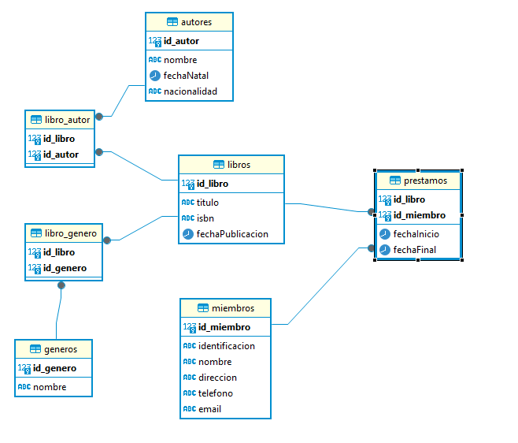

# Modelo conceptual de BBDD

Ejemplo de una  biblioteca
 

 

## Cardinalidad 
Existen las entidades independientes: autores, generos y miembros.
 
Y las tablas intermedias: libro_autor, libro_genero y prestamos.
 
La relación entre generos/libro_genero es de muchos/muchos.
La relación entre libro_genero/libros es de muchos/muchos.
La relación entre autores/libro_autores es de uno/muchos.
La relación entre libro_autor/libros es de muchos/muchos.
La relación entre miembros/prestamos es de muchos/uno.
La relación entre prestamos/libros es de uno/uno.